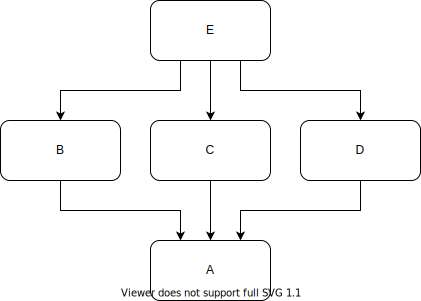

# 如何复用一套代码支持多样性的业务？

有太多的文章教你怎么组织代码了。但是这些文章大都是系统A，模块B的抽象写意派。虽然看着很有道理的样子，但就是看不懂。
本文的特点是有十多个带有具体业务场景的例子。从如何接新需求的角度来分析模块应该怎么拆分。

全文分为四个章节：

* [模块切分的好坏标准是什么？](#criteria-of-modularization)
* [这些经典的解决方案用了也就那样](#module-boundary-unchanged)
* [松耦合的接口应该定义成什么样子？](#loosely-coupled-interface)
* [为什么实际的业务代码都没有写成你说的那个样子？](#obstacles)

# 模块切分的好坏标准是什么？ 

复用，以及支持多样性，都是同一个问题的不同表述。其实质问题是如何对系统进行模块分解。需要分成几个模块，模块之间的依赖关系是怎样的？下面通过四个具体的例子来说明。

## 公共模块应该稳定

[【阅读该例子】](./criteria-of-modularization/common-module-should-be-stable)

在 [Agile Software Development](https://www.amazon.com/Software-Development-Principles-Patterns-Practices/dp/1292025948) 书中，Robert Martin 讲过了很重要的两个原则

* 越是被很多模块依赖的模块，越应该减少改动。道理很简单，底层模块一改，上层的模块必然受到影响。依赖关系的方向，就是“不稳定”依赖“稳定”的方向。
* Common Reuse Principle。要复用的模块不要把过多的东西捆绑，要复用就整体复用。

## 避免超级繁忙的顶层模块

[【阅读该例子】](./criteria-of-modularization/avoid-crazy-busy-top-module)

模块与模块之间的依赖关系，就是抽象与稳定的关系。但实践中，像“业务编排API”和“BFF”，你很难判断谁比谁更稳定，更抽象。当我们一个业务请求，需要经过一串模块的时候，往往是有问题的。因为当要做修改的时候，你会觉得在哪个环节拦一刀都有道理。David Parnas 在 [The Secret History of Information Hiding](https://www.researchgate.net/profile/David_Parnas/publication/200085877_On_the_Criteria_To_Be_Used_in_Decomposing_Systems_into_Modules/links/55956a7408ae99aa62c72622/On-the-Criteria-To-Be-Used-in-Decomposing-Systems-into-Modules.pdf?origin=publication_detail) 一文中也写道，他认为 Levels of Abstraction 是很难判断的。

这个例子应该怎样调整是合适的?分法有很多，可以按流程步骤分，可以按业务变化频率分，但从依赖关系的结构上来说，一定是这样的结构

* 一定是**多个模块**直接面向**多个业务方向**，每个模块承担一些，而不是集中把修改工作都压到一个顶层模块上
* 在这多个模块上面一定不能拿一个“业务收口”模块载往顶上套一层。所谓业务编排，其实就是业务编程。只要可以编程，就会抑制不住地往里面加东西。

不会因为把函数调用，改叫“业务编排”，就改变模块之间的依赖关系。依赖关系才是真正决定性因素。

## 通过新增模块来扩展功能

[【阅读该例子】](./criteria-of-modularization/extending-by-adding-new-module)

从这个例子里我们可以看到如下的规律

* 一个新功能要修改哪个模块取决于模块的依赖关系。typescript-language-features 在依赖关系里有 ts server，所以一些功能就得改它那里。
* 新增模块来实现新功能可以避免把给现有模块添加新的依赖，比如 mocha 这个依赖就只需要加到 mocha-test-explorer 上。是否新增一个模块，还是修改已有的模块，是否引入依赖是一个关键决策因素。

稍微有点经验程序员都能体会到 vscode 做为 Eric Gamma 大神在 eclipse 之后的又一力作，架构上是很优秀的。但可能只是感觉优秀，又说不出来优秀在哪里。通过这个例子，我们就可以看到，判断一个模块拆分结构是否优秀的唯一标准，就是看它如何处理需求的变更和新增。当所有的需求都要往一个模块里改的时候，这个拆分就是糟糕的。当新的需求往往可以通过新增模块来实现的时候，这个拆分结构就是优秀的。

## 要更关注“易变性”而不是“功能切分”

[【阅读该例子】](./criteria-of-modularization/more-focus-on-violatility-than-functionality)

这个例子说明了

* 按流程步骤切分未必是最优方案，“易变性”是更重要的可度量指标，其实看看 git 提交记录就知道了
* 前面三个例子都是说明不要把改动集中到一个模块里，这个其实相对好实现。极端情况下，每个函数，每一行代码都拆成一个模块就可以实现。
* 这个例子要说明的是反过来，如果一个需求要改动太多的模块，那也是有问题的。这个其实非常难以实现，但是是追求的目标。

## 模块切分的好坏标准

模块切分的出发点其实非常简单直白

* 如果所有的需求都要集中到一个模块去等排期，那必然会拖慢速度
  * 公共模块应该稳定
  * 避免超级繁忙的顶层模块
  * 通过新增模块来扩展功能
* 如果一个需求动辄就要数个模块联合开发和调试，那必然会拖慢速度
  * 要更关注“易变性”而不是“功能切分”

综上，在这样的一个依赖关系下

经常修改的应该是中间这一层。最好是一个需求只添加，或者修改其中的一个模块。

模块划分的静态结构无所谓好坏，只关注新需求如何修改或者新增的问题。
不用去争辩是应该大前台，还是大中台。代码量不是问题，圈复杂度也不是问题。
唯一度量的标准就是去看每个新需求都是怎么改出来的。

# 这些经典的解决方案用了也就那样 

上一章提出的好坏标准有任何一条是新鲜的么? 一条都没有。
以前的文章可能例子举得少了一点，但是总结的原则都是差不多的。
那接下来的追问就是，如果原则一直都在那里，那为什么我们过去看过的代码都没遵守这些原则呢?
我有三个猜测

* 最容易想到的解决方案未必是最佳的方案
* 真正松耦合的接口定义形式并没有被大众所熟知
* 按照这些松耦合的接口去分解模块并不容易落地

我先来分析第一个猜想，列举几个最常见的解决方案。

## 用 interface 代替 class

[【阅读该例子】](./module-boundary-unchanged/replace-class-with-interface)

这个例子里说明了两个现象：

* 按流程步骤切分的模块，步骤之间必然有很强的数据依赖。这种业务逻辑上的依赖，用任何形式上的解耦合方式都是不起任何作用的
* 名字具有欺骗性，收银台这样的生活中能够遇见的物理存在的概念，和业务上实际承担的角色可能是不对等的。你在商场里看见的收银台，和你这个系统里的收银台，只是名字相同。不能简单地认为 `pay(100, 'USD')` 就可以完全把服务给封装起来。

如果这种一个模块需要 `f(args)` 传递一个很大的结构体给另外一个模块的方式是不理想的。那么更理想的模块间接口形式是什么?[有些文章](https://www.ben-morris.com/why-is-loose-coupling-between-services-so-important/)会把运行时的RPC性能，系统不宕机，和不易于独立做需求变更放在一起讨论。但是我认为这样混到一起来讨论问题会误入歧途。比如是不是数一数两个模块之间的 RPC 调用的数量，甚至是从运维系统里导出一份运行时的 RPC metrics 就可以说明两个模块的耦合程度呢?

应该聚焦在“新需求怎么接”这一个问题上，不要躲闪，不要旁顾左右而言它。其实就是看一下，两个模块之间边界无论用什么来定义，是不是经常要被修改。用 interfac 关键字代替 class 关键字不会有实质性的作用。用 gRPC 代替 jar 包也不会有实质性的作用。

## 阿里中台到底是什么?

阿里巴巴公司有一个名字叫“中台”的技术。

[【阅读该例子】](./module-boundary-unchanged/alibaba-middle-office-technology)

这个例子说明了两个现象：

* 没有复用价值的复用是不值得去复用的：阿里内部至少三套“中台”框架。商品和交易链路对于淘系，盒马，闲鱼也是不同的。因为大家做出了判断，之前的方案，之前的模块，对当前的业务需求没有复用价值。这是一个理性的决定，不复用很多时候是正确的选择。
* 没有消除 if/else 的银弹。不调整模块边界，只换一个if/else的表达方式，是换汤不换药的。

## 不调整模块边界是没有效果的

上面的两个例子的共同特点就是用一个形式代替另外一个等价的形式

* 函数调用是进程内调用，还是基于 protobuf 的 RPC，从接口是否易变的角度来说是等价的
* 是代码内用 if/else，还是转化成对扩展点的配置文件，从接口是否易变的角度来说也是等价的

最容易想到也是最容易办到的方案，未必就是最好的方案。

# 松耦合的接口应该定义成什么样子？

上一章我们看到了，只是改变依赖的“形式”，不会影响依赖的“实质”。
如果要让模块之间更好组合，最终仍然是要去调整模块之间的边界，也就是要把“模块接口”定义成“松耦合”的。
“松耦合”已经是陈词滥调了。能不能用具体的例子来说明到底这样的接口是长什么样子的?

## 基于 UI 的组合

[【阅读该例子】](./loosely-coupled-interface/ui-composition)

这个例子展示了两个最实用的技术：

* 在 UI 上做组合，对于编排方来说，UI 组件内部就是一个完全的黑盒。
* Opaque Business Pointer：透传业务 id，每个模块都可以根据这个 id 来解决出自己需要的含义来。对于透传方来说，这个 id 就是一个完全的黑盒。

无论是“UI组件透传”，还是“id透传”，从耦合级别上来说都是最黑盒的那种。

## 不要返回值

[【阅读该例子】](./loosely-coupled-interface/no-return-value)

这个例子说明了两点：

* Event 就是不要返回值。所以两个模块之间交换的信息更少，接口就更松耦合。
* 单独由后台开发引入 Event 往往无法达成目的。需要配合前端团队引入“基于 UI 的组合”，以及配合产品团队引入“产品方案降级”才能调整得动边界。模块之间的边界是不能靠一个职能团队撬动的，必须集合前端，后端，产品多方的合力。

## 虚拟文件系统

[【阅读该例子】](./loosely-coupled-interface/virtual-file-system)

这个例子说明了两个技术：

* 一个模块可以把自己伪装成“虚拟文件系统”。让使用者感觉自己就是在读写一个存储而已。
* pull v.s. push：在所有视图渲染，事件模式检测类的业务里。pull 都是更好的策略，它可以产生最精确的依赖关系，减少变更的影响范围。

当“UI 组合”这种纯黑的方案不行，“不要返回值”这种半黑的方案也不行，那么伪装成存储是需要模块间双向通信的前提下的比较优的解决方案。

# 为什么实际的业务代码都没有写成你说的那个样子？

这是一个真正拷问灵魂的问题。

* 有大量的实际业务中的项目，违反了所有的最佳实践。但是商业上仍然大获成功
* 从1971年的《On the criteria to be used in decomposing systems into modules》开始，就不断鼓吹要做好模块分解。为什么这么多年过去了，不但没有看见进步，甚至感觉还在退步?

前两天在朋友圈刷到一句睿智的话

* 当你听到别人的一个想法的时候，先想想为什么行得通
* 当你要提出一个想法的时候，先想想为什么行不通

行得通的理由

* 虽然不用最佳的模块切分，会导致更多的联合修改联合调试，但是仍然可以完成需求
* 目标是及时响应市场需求，这并不完全依赖好的模块切分。通过996，通过找更多的人，仍然可以达成目标。
* 编码只是响应市场需求要做的工作中的很少一部分，只要能实现，就不决定成败。有的时候系统宕机，可能更致命，更值得解决。
* 设计简单，新人更容易上手
* 弊端需要成年累月才会显现出来，对创业期没有影响
* 技术革新速度很快，新公司倒闭速度很快，代码本来就应该隔几年重写一次
* 数学家总是希望自己的定理尽可能泛化普适，而工程师为了效率等原因，更追求适用就好

行不通的理由

* UI组合：前端技术最近几年变动特别剧烈，一直稳定不下来
* UI组合：UI非常专业，需要独立的团队。没法实现端到端的业务切分
* 不要返回值：我要返回值啊，没返回值实现不了界面，实现不了需求
* 运行时报错信息是在一起的，这么分着写很难和运行时的现象对应起来
* 编辑的时候往往需要在更多的模块/目录/文件之间跳转
* 需求可能是跨模块的，创新性的需求往往会对模块化的假设产生剧烈的影响
* 产品经理的分工调整，产品需求的粒度是经常变化的，导致一个产品经理需要改多个模块

我们要客观地看待复用和支持多样性。很多时候不复用就是最佳的解决方案。很多时候堆砌 if/else 就是最佳的解决方案。

在保持客观理性的同时，能不能把“行不通”的种种障碍逐一分析以下，给每种类型的障碍提供一个切实可行的解决方案呢?

【未完成 TODO】