假设有如下的论坛业务，其现有模块划分如下图所示

用户每次发帖，都要给用户添加一些积分。

假设需要添加一个需求，用户一天发了三个帖子之后，完成了“每日活跃”任务，额外奖励更多的积分。如果是修改“帖子模块”就是

在发放积分之前，先查询一下任务模块，再决定发多少。

假设又有一个需求，如果是新用户发的首个帖子，需要给邀请人发放积分。如果仍然是修改“帖子模块”，就需要变成这样

从做需求的角度来说，帖子模块已经在发放积分了，我这个需求不过是给如何发积分添加了一些花样而已，改动很小的。但是每次改动，仍然是需要帖子模块和其他模块进行联调。
要减少模块之间的耦合就是要减少模块之间这样的 `f(args)` 的直接调用关系。

帖子模块把新建帖子的事件发到消息队列之后就可以不管了。任务模块，拉新模块要做什么自己的逻辑，都可以自己去订阅这个消息队列。
帖子模块用对“消息队列”的依赖，替换了对积分模块，任务模块，拉新模块的依赖。

> 这个技术不就是 Event Driven 吗?我跟你说，这个是行不通的。满足不了我的业务需求

以上这样的对话经历过几次之后，可以总结出以下的常见反例

* 业务的下一个步骤是不可或缺的。比如你打了个车，这个订单变成一个 event 有什么意义。用户要的是有车来接我，主流程上玩花活没有收益。
* 业务必须及时完成，我跳转的下一个页面就需要这个数据那，你异步的 event handler 消费慢了一点怎么办?
* 我这个RPC接口的返回值上有这些字段是界面必须要的，如果改成发消息异步处理了，我RPC接口就得改了，前端那边不干啊
* 什么！?你要改产品方案，改界面?是不是没有被PM毒打过?

对于所有得反例，你只需要记住一个问句就可以：

> 如果这个依赖宕机了，我这个RPC就不能降级吗? 降级之后的界面怎么显示缺失的“返回值”?

在一个虚构的出行系统里，司机在结束计费的时候能够看到本单能收到多少费用。理论上来说，可以在结束计费的时候通过 Event 来出账单。但是因为结束计费和展示费用在产品设计上是一体的，所以这个基于 Event 的解耦一直无法实现。直到因为同步出账产生了太多次 P0 事故之后，终于在展示费用这个产品功能上添加了一个可降级的版本。也就是当费用还没有计算出来的时候，展示“费用计算中”。通过产品需求的调整，实现了模块之间的松耦合。

只要是可被降级的依赖，就是可以被异步化的依赖。