假设有这么一个虚构的故障检测与分析的业务， 其模块构成如下


从网络探针，主机Agent等多个渠道，都会有探测器不断上报到消息队列里。掉底watchdog订阅消息队列，监控是否有数据中断的情况。盗刷风控则是反作弊团队维护的规则引擎，有复杂事件的检测能力。数据汇总给故障分析模块，进行统一的根因分析。为了协助故障分析，前置了一个通用异常检测模块，去筛选出正常事件流里的异常特征，例如同环比的突变等。

假设有一个需求是要支持指标的一定程度的延迟和乱序。比如SSO平台事件可能会稍微晚30s才上报过来。为了支持事件流到达顺序的不一致，掉底watchdog需要添加一个缓冲区，晚一点才做掉底的识别。盗刷风控也需要加一个缓冲区，通用异常检测也需要加缓冲区。所有消费事件的处理模块都需要做一遍修改。各个处理的时间也可能不同，所以最终到达故障分析模块的时间也可能不同，所以故障分析模块也需要加一个缓冲区来汇总。

假设又有一个需求，网络探针模块进行了升级，从 protobuf 的序列化格式，修改成了 thrift 格式的。虽然掉底 watchdog 和盗刷风控都是订阅的消息队列，但是对消息的格式的变化仍然需要修改这些下游模块。即便这个消息格式的变化引入的新数据对掉底 watchdog 来说毫无价值，仍然需要修改掉底 watchdog。其实从掉底与否的角度来说，你报了就是报了，没报就是没报，对报文内容是完全不关心的。



如果我们把依赖关系翻转过来，从 push 改成 pull 则会方便很多。所有的事件上报都在上报之前就统一成同样的格式。引入一个 window 模块把最近一段时间内的事件存入多维分析的数据库里。

对于掉底watchdog来说，基本上永远不用修改了。就是定时查询一下 window 模块，看看是不是有数据中断就可以了。

对于盗刷风控来说，可以把自己的内部 buffer 给去掉了。由 window 模块统一屏蔽了事件上报的乱序和延迟问题。查询的维度和指标都是按照业务需求来确定的，不相关的上报格式的修改，只要不牵涉到关心的维度，就可以不修改盗刷风控模块。

对于故障分析来说，之前是被动接收事件

```typescript
onNetworkAnomaly(site, floor, segment) {
}
onClusterDown(cluster) {
}
```

所有的事件都是已经分析出来的结论，计算已经做完了。提供过来的信息就是所有能提供的信息。
而把依赖关系反转过来之后，就是故障分析根据自己所需要的信息去查询：

```typescript
queryAnomaly(target, anomalyType)
```

这样做的好处是可以最小化依赖。如果故障分析不需要的信息，就可以不会被使用到。
假设上游提供了一个目录的数据供查询。下游根据实际需要决定的查询的路径，比如 `readFile('site1/cluster1/anomaly')` 。也就是基于 pull 的策略，来按需决定依赖。那么没有使用到的路径，比如 `site2/cluster3/anomaly` 改动了也不会有影响。
而且还有可能，这个计算是按需触发的，也就是你去调用 `queryAnomaly` 的时候现算的。就算是你使用的是文件系统的 api，比如 `readFile`，linux 也有 FUSE 这样的文件系统，可以把 readFile 转换成例如查询 gmail 邮件这样的网络调用。从数据提供方选择“实现方式”的角度来说，提供 query 性质的接口也给予了实现更大的灵活度。