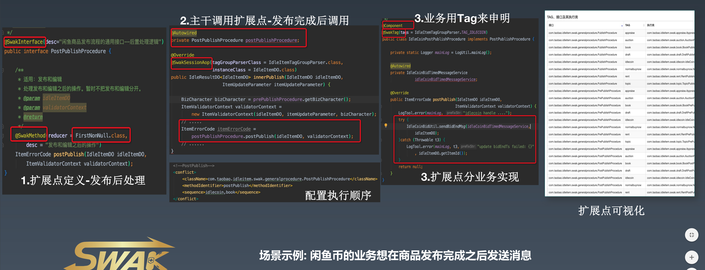
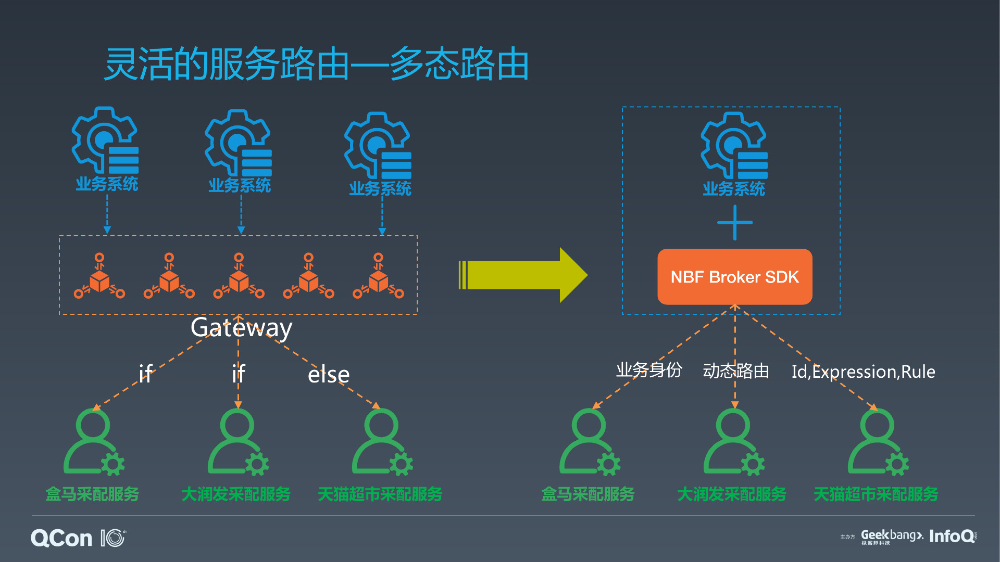

# 参考资料

下面是关于阿里中台的一些公开资料

## TMF & 星环

* 阿里玄难：面向不确定性的软件设计几点思考 https://mp.weixin.qq.com/s/Uc_wJSVQr7sSz2js2pb3OA
* 如何实现32.5万笔/秒的交易峰值？阿里交易系统TMF2.0技术揭秘 https://mp.weixin.qq.com/s/Pm9L57iSWhjTE2WqJWrQeg
* 大麦交易融入阿里电商平台之路 https://www.infoq.cn/article/W3Ztwqs9Q4aStbksD0mJ
* 阿里发布业务平台解决方案 预计3年内将帮助业务提升10倍效率 http://www.cww.net.cn/article?id=432702
* 2017双11交易系统TMF2.0技术揭秘，实现全链路管理 https://segmentfault.com/a/1190000012541958

## SWAK

* 闲鱼从零到千万 DAU 的应用架构演进 https://www.infoq.cn/video/aPw3FJXaLwt75zWL8Myz
* 在闲鱼，我们如何用Dart做高效后端开发？ https://mp.weixin.qq.com/s/jAD3hacFMVcOv9GnAfCFOw
* 业务代码解构利器--SWAK https://mp.weixin.qq.com/s/iS7QjI-LSOET4cmRGo_Jow
* 老代码多=过度耦合=if else？阿里巴巴工程师这样捋直老代码 https://mp.weixin.qq.com/s/_BvHA2gzSd6CFytcE1ZU0w

## NBF

* NBF：新零售服务开放的 Serverless架构与深度实践 冯微峰 https://myslide.cn/slides/21861# https://time.geekbang.org/dailylesson/detail/100040849
* 为什么它有典型FaaS能力，却是非典型FaaS架构？ https://www.jianshu.com/p/716ae8f4d219
* 盒马核心系统架构演进 http://ddd-china.com/look-back-2018.html
* 为了30分钟配送，盒马工程师都有哪些“神操作”？ https://juejin.im/entry/6844903800470257678
* 盒马生鲜搜索服务化实践与思考 https://m.yubaibai.com.cn/article/5553042.html

# 祛魅

这个例子就是前面的三张图。图没看到的同学，请打开科学上网。
阿里中台在外边的名头很响。但是一直都挺神秘的，不知道中台到底长什么样子。
希望你看完这三张图之后可以大概明白阿里中台是一个什么样的解题思路。

这么多链接的文章也不会有人去读的，我帮你们高度总结一下阿里中台的思路：

* 出发点是业务的能力（Capability）的复用，而不是代码的复用。代码之上的运营流程，人员，组织这些都是 Capability 的一部分。
* 落地方案由后台开发人员主导，以 Java 为主要实现语言。
* 最终在代码里体现为中台部门写了一个 Java 框架给业务开发用，主要解决 Java 后台代码里 if/else 杂乱无章的问题。