在一个虚构的电商系统中，我们有如下的模块划分


其中购物车实现了价格的计算，包括整个 invoice 的 total，以及每个 line item 的原价和折后价格。而收银台则实现了通过不同的渠道来支付。包括支付宝和微信这些现付渠道。一些企业给员工开通了企业预付的福利，可以在一定的额度内由企业预付，避免员工买完之后再去报销。

单单从现有需求来说，购物车和收银台之间是一个非常简单的接口。就像你在星巴克买一杯咖啡一样，结账的时候也就看个总价。所以从收银台的角度来说，购物车你给我这些信息就够了：

```typescript
pay(args: {
    totalAmount: number;
    currency: 'CNY' | 'USD';
})
```

这个接口和是否使用依赖倒置原则，是否使用 interface 隔离是没有关系。比如我们把购物车和收银台之间的直接依赖，改成共同依赖一个“插件化系统”。



这个接口可以表达为等价的 interface，只是换了个写法：

```typescript
interface Invoice {
    totalAmount: number;
    currency: 'CNY' | 'USD';
}
```

从依赖关系图的表面上来看，购物车和收银台是没有直接的依赖了的。这个也说明了“依赖关系图”是可以被欺骗的。实际上，因为在业务流程上，购物车和收银台之间的上下游关系，导致两者之间是有牢不可破的数据依赖关系的。

比如企业发现员工经常在平台上买个人用的香烟，而不是书籍。所以企业希望，预付款仅限于给员工购买文具和书籍这两个品类下的商品。那么这个信息就必须从购物车传给收银台。


```typescript
interface Invoice {
    totalAmountInWenJuAndShuJi: number;
    totalAmount: number;
    currency: 'CNY' | 'USD';
}
```

然后收银台拿着传过来的额外字段，把账单一份为二，包括可以用预付的部分，和员工自付的部分。但是对于没有开通企业预付的普通消费者，展示的就只有 totalAmount。

过了两天，微信突然提升了虚拟物品（唱片之类的）的手续费。平台不想补贴这部分的交易手续费。所以希望在用户选择了用微信支付，且购买了虚拟物品的时候，由用户支付额外的微信渠道手续费。但是不能直接给虚拟物品提价，因为如果选择支付宝支付的话，支付宝的交易手续费还是比较低的。这个时候，购物车就又要改这个接口


```typescript
interface Invoice {
    totalAmountInXuNiWuPin: number;
    totalAmountInWenJuAndShuJi: number;
    totalAmount: number;
    currency: 'CNY' | 'USD';
}
```

我们可以看到，虽然我们使用了面向接口设计，使用了依赖倒置原则。但是这些东西都没有办法阻止你一而再，再而三的修改购物车和收银台。依赖倒置确实让购物车避免了依赖微信支付的接口，支付宝支付的接口这些实现细节。从这个意义上来说，依赖倒置是成功了的。但是仍然无法避免购物车依赖 Cashier.protobuf 这个“接口定义”本身。当业务变更导致不仅仅是实现需要修改，接口本身也不得不修改的时候，面向接口编程并无帮助。

每次修改都需要双方进行接口商定，以及联合调试。这个还是在收银台仅仅对接了支付渠道的情况下，如果收银台同时还要负责选择优惠券等业务，可以预想，这样的接口修改会更加频繁。