假设在一个虚构的电商业务里，我们有如下的模块划分结构

底下的各个微服务之间互相没有依赖关系。为了实现业务流程，安排了一个“业务编排API”模块来把这些微服务串联起来。同时为了让前端开发迭代效率更高，前端团队用serverless搭建了一个BFF模块（Backend for frontend）用来给前端页面收拢数据接口。我们不讨论现存代码量是多还是少的问题，也和粒度切分没有关系。我们只考虑新需求在哪里做的问题。

假设商品评论页需要允许没有购买过此商品的人也可以评论，但是购买过商品的人会在旁边加一个标签“验证购买过”，以表示这条评论更加真实可信。这个需求需要使用订单信息，所以商品微服务自己是无法完成这个业务逻辑的。那么我们有两个选择

* 修改“业务编排API”
* 修改“BFF”

如果是一个前端同学来写这个需求，他可能就加到 BFF 里了。如果是一个后端同学来写这个需求，他可能就加到业务编排API里了。

假设我们又有一个需求，需要售卖电子书。然后在退货退款页面里，对于电子书要把退货这个选项给去掉，因为电子书也没有发货和物流的概念。那么显然这个需求订单自己也搞不定，需要在产品目录里先把电子书这个品类上架上去。然后需要在退货退款页面里，加上可选项的接口调用。同样的，我们可以选择把这个“退货可选项”的接口加在业务编排API里，也可以加在BFF里。

然后我们又有一个需求，需要在订单结算页里添加蜜豆（一种代金券）可抵扣和不可抵扣的拆分。那么同样的，只有业务编排API和BFF同时拥有访问蜜豆配置（是否可抵扣）和商品目录（价格）的依赖关系，所以这个需求再一次地需要麻烦业务编排API的同学了。

我们可以总结出两个规律来：

* 因为依赖关系，决定了流程性的业务只能在上层的模块里写，因为那里的信息最全。
* 当“业务编排API”和“BFF”除了名字不同，依赖等级几乎完全相同的时候，我们很难判断谁比谁更抽象，谁比谁更稳定。

稍微有点经验的同学都能看出来，这种啥需求都往一个模块里改的模式是不可持续的。造成这样的原因在于最顶层的模块一定是最不稳定的，因为在那个地方写业务是最方便的，大家都想改那里。然后以“业务收口”的名义，只放一个模块在最顶层，就会导致所有的改动都集中到这一个模块里。
