# 混合型 UI

这一类需求和离散型 UI 不同。界面上没有明显的大区块。很难说哪个 Git 仓库可以把完整的一部分拿走。例如


购物车是典型的混合型 UI。没有哪个 Git 仓库可以声称对界面上的某个区块负责。会员价和限时特价都想给商品打上自己的标，但是实际算价格的时候得看用哪种优惠算得的价格更低。
在这种比较恶心的复杂需求下，如何最大化 autonomy 呢？

## 数据集成

我们可以使用服务端数据集成的方式来实现这个需求。数据集成可以实现任意复杂的需求，是对需求形态限制最小的集成方式。



这种集成方式

* 从依赖方向上：业务API依赖商品信息，会员优惠，限时折扣
* 从接口形态上：接口是数据，所有的字段都需要明确定义

由业务API做统一的数据汇总。价格谁更低，标打谁的标，这些都由业务API来最终决定。

## 责任链模式

比如 Java Servlet Filter，长这个样子


其接口是

```java
public void init(FilterConfig config)
public void doFilter(HttpServletRequest request,HttpServletResponse response, FilterChain chain)
public void destroy()
```

所有的 filter 都能拿到完整的 request 和 response，然后对这个 request / response 做自己的修改。
最终返回到界面上的是所有 filter 处理完成的结果。

也就是说 HttpServletResponse 这个代表了界面，每个 filter 都在渲染这个界面。而 HttpServletResponse 规定了这个界面长什么样呢？

```
header
status
body
```

数据结构非常简单。这样的接口当然稳定，但是也限制了用 HttpServletResponse 去表达更复杂的业务需求。

## 数据驱动界面

运营位是指给界面上留下固定的位置给运营来配置


把一个界面做成数据驱动的，哪些地方留了多大槽，可以配置什么东西。
营销玩法是无穷的，策略是天天变的，但营销位是相对来说变化不那么频繁的。

## 责任链加工界面

结合上面两种模式。我们可以得到“责任链加工界面”的做法。

首先把购物车界面数据化，把每一块都可以配置什么定义成标准的数据结构。

```ts
export class Cart {
    public order: Order;
    public cartProductItems: CartProductCard[] = [];
}

export class CartProductCard {
    public isEditStatus: boolean = false;

    public orderProductItem: OrderProductItem;

    public isChecked: boolean;

    public image: string = '';

    public variantInfo: string = '';

    public name: string = '';

    public count: number = 0;

    public price: number = 0;

    public inventory: number = 0;

    public actualPrice: number = 0;

    // '商品缺货' | '商品下架' | '规格失效' | '库存紧张
    public productStatus: string = '';

    public createdAt: Date;

    public tag?: string; // 商品名称前的tag标签值

    public readonly specExtra?: string; // 优惠选择

    public productPromotionType: string = '无优惠'; // 会员价\限时价\无优惠
}
```

然后搞一个责任链来加工这个界面

```ts
export class CalculateCart {
    public run(order: Order) {
        let cart = this.calcCartFromOrder(order);
        cart = this.calcProductPromotions(cart);
        cart = this.calcOrderPromotions(cart);
        return cart;
    }

    public calcCartFromOrder(order: Order): Cart {
        throw new Error('calcCartFromOrder not implement');
    }

    public calcProductPromotions(cart: Cart) {
        cart = this.calcMemberPromotion(cart);
        return this.calcXszkPromotion(cart);
    }

    public calcXszkPromotion(cart: Cart) {
        return cart;
    }

    public calcMemberPromotion(cart: Cart) {
        return cart;
    }

    public calcOrderPromotions(cart: Cart): Cart {
        return this.calcMjmzPromotion(cart);
    }

    public calcMjmzPromotion(cart: Cart) {
        return cart;
    }
}
```

这样我们就把购物车界面的业务逻辑拆分成了两部分：

* 接口部分：Cart 和 CalculateCart 是接口。变动相对来说不频繁。
* 实现部分：具体的 calcXszkPromotion，calcMemberPromotion 这些界面渲染方法

利用依赖倒置，我们可以把 CalculateCart 定义在依赖关系的底层，由限时折扣，会员优惠这些 Git 仓库去做接口实现。


相比 HttpServletResponse，Cart 这个接口显然更不稳定。只能在一定范围内的业务修改可以不去改 Cart 的定义。
但是 Cart 代表了 UI 一致性，在不同的业务逻辑里有一定的复用性，比如：

* 商品下架了，购物车里已加购的商品显示到“失效商品”里（因为没货了）
* 配送模式从快递改为自提，购物车里仅限快递的商品会显示到“失效商品”里（因为配送模式不支持）

虽然商品下架业务逻辑，自提的业务逻辑，完全没有关系，但是在购物车的展示失效商品的时候，可以以 UI 一致性的理由去做成一样的。

## 小结

对比“数据集成”和“责任链加工界面”，两个的区别在于是否易于判断一个新需求该改谁。

在数据集成的实现方式里，业务API是无所不能的，大部分需求都可以改业务API，也可以去改限时折扣这些Git仓库。
这就导致需要依赖Code Review，人肉确保没有把所有的业务逻辑都堆砌到最顶层的业务模块里。

责任链加工界面，其接口是显式定义的 Cart 和 calculateCart。
每个具体的业务都是直接返回的 Cart，而不依赖于业务 API 的二次翻译。
所以相对来说，calculateCart 里可以只放必要的规则互斥之类的逻辑，而不需要太关心什么数据放界面哪个位置这样的事情。
这样做更容易在改业务逻辑的时候判断应该改哪个 Git 仓库。
Code Review 也可以把注意力主要放在 Cart 和 calculateCart 的修改是否是必要的上。

