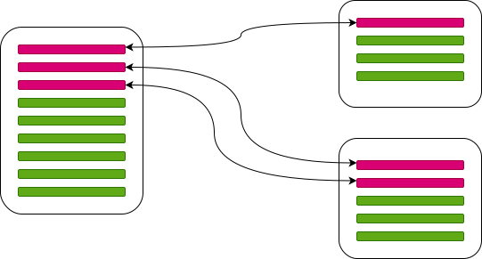

# 会议时间

如果 Autonomy 的问题是高沟通成本，那么是否可以直接度量整个沟通成本。例如参与会议的时间，这是一个可能的指标。这样的指标会有什么问题呢? 有没有更好的指标?

度量会议时间会有如下的问题：

* 会议没有包含全部的沟通成本，包括面对面沟通，IM沟通等
* 不开会可能是因为没有新需求
* 开会多可能就是因为需求多，说明业务蒸蒸日上
* 开会多少只说明了成本的高低，只要最终的效能好不就 OK 了么? 或者换句话说，只要业务赚钱不就 OK 了么?

最有效的当然是总收入，总利润这样的结果指标。但是不能一竿子断定所有的过程指标都没有意义。不可能所有人都背最终的结果指标，也不可能所有的改进都要从结果指标入手。会议时间显然能说明成本构成，只是这个成本是否花得值很难判断。一个劳动者只有8个小时的符合劳动法的工作时间，如果有7个小时都在会议上，显然能够说明一些问题。所以我认为会议时间做为观察性的过程指标还是有一定意义，主要的作用是划个红线，超过了红线说明会议太多了。

会议时间这个指标的问题在于无法指导改进。因为开会多，可能仅仅是需求变多了。

# “接口改动” / “实现改动” 比率

我们把Git仓库内的文件分为两种类型，负责接口的文件和负责实现的文件。如下图所示

理想的情况下，应该尽可能少的改接口，而是主要去改实现，这样才能减少跨Git仓库的人员沟通。如果一个新需求，需要同时改动N个Git仓库。但是只要不需要改动接口（包括用 `Map<string, any>` 这样形式搞的隐式接口），仍然是理想的情况。虽然产品经理需要和多个团队沟通每个部分的需求是什么，但是开发团队之间的沟通仍然可以比较少。要每个新需求都只改动一个Git仓库由一个团队负责。或者说每个“产品”都仅由一个团队端到端负责。我认为这是不太现实的：

* 新商业玩法往往是破坏性的。我们不要去做提前预测
* 需求大小是任意的，产品经理分工也是有随机性的。总是有办法把一个需求弄大到全公司只做这么一个需求的地步
* 啥叫一个产品，啥叫端到端，各种解读都行

接口完全不修改，开发人员之间完全不沟通也是不可能的。我们要关注的是目前的业务逻辑拆分是不是合理，多个 Git 仓库之间的接口如果需要频繁调整，那么说明 Git 仓库是不是分得过多了，或者边界不是最佳的。要根据新的输入，不断去审视过去做过的拆分决策。而 “接口改动” / “实现改动” 比率可以量化目前业务逻辑拆分是否让每个 Git 仓库有多少 Autonomy。这个值越小，说明仅改动实现情况占比越高，自主性做得就越好。

为了数据统计比较稳定：

* 仅做到文件级别的区别。一个文件要么属于接口，要么属于实现。一般通过技术手段都可以做到这样的隔离。
* 一天无论改了多少次，改了多少个文件都记为“1次”改动。这样避免了分多次提交，或者文件数量多寡引起的数据波动。

极端情况下，我们可以不分 Git 仓库，或者只有两个 Git 仓库，从而让 “接口改动” / “实现改动” 比率比较好看。这个也说明了分 Git 仓库的成本。把业务逻辑拆得越碎，必然会导致跨团队的沟通会上升。Git 仓库不是分得越多就越好，而是满足了团队的并发数就可以了。

这个指标的另外一个问题是日常性的文案修改会导致实现改动非常多。所以我们要以“Consistency”维度的指标去平衡。假设我们已经有了一种统一的文案配置机制。那么需要有一个“文案配置机制”接入率的指标。这样就可以避免日常性的例行修改破坏这个指标的真实性。

[《A Philosophy of Software Design》](https://www.amazon.com/Philosophy-Software-Design-John-Ousterhout/dp/1732102201) 很重要的一个观点就是 "Modules should be deep"，这样的隐喻让人们把注意力放在了静态的结构上。其实作者的本意是接口如果比实现要小很多的话，接口被修改相对于实现被修改的概率也就小了很多。这样我们大部分时候就可以只改实现，而不改接口。“业务逻辑拆分”其成本和收益都要在接下来做新需求的过程中体现，抽离了业务变更的时间轴，静态的代码结构无法度量其好坏。