# 相加的关系

显然我们可以把业务逻辑分解成如下的多个Git仓库

这些一次性的Git仓库会相加到一起，就构成了完整的业务逻辑。

# 相乘的关系

然后我们会意识到，有一些重复的模式。
比如说这后台的表单都长得差不多啊，我们把表单的校验和错误回显封装个UI组件吧。
然后所有的后台表单都必须复用这个UI组件。
这样为了保障实现的一致性，就引入了相乘的关系

我们可以完全没有相乘的组合关系，而完全依赖相加来组合。但是相乘的组合关系通过只需要维护一份，使得一致性可以更好。

# 一致性

假设我们把业务拆分成了一堆 Git 仓库，它们之间构成如下的依赖关系

在整个依赖关系树上面，我们可以画一根线。线之上的 Git 仓库定位就是一次性的，通过“相加”组合满足特定的业务需求。
我们仅仅要求 Autonomy 和 Feedback 的指标。

线之下的 Git 仓库定位是“保障整体的一致性”，是“相乘”的组合关系。
除了要求 Autonomy 和 Feedback，还额外增加了 Consistency 的度量指标。
这些 Consistency 指标的主要目的就是防止过度抽象，什么都想“可复用”，导致 Autonomy 受损。
可以说这些 Consistency 指标实际上是度量了“可复用性的质量”。

实际上这些可复用的轮子，与编程语言，操作系统，物理硬件能有多少区别呢？
区别仅仅是“开源社区共识”，还是“公司部门范围内的共识”罢了。
有野心一点的公司，或者业务模式内在一致性比较高的公司，大可以发明自己的领域特定语言（Domain Specific Language）嘛。
只要这个发明出来的 DSL 不是只适用于一两个地方，能够通过 Consistency 指标的检验，那就是有价值的。