最理想的拆分后又组合的方式是“粘贴”到一起。就像你把一块砖，劈开了。拼装回去就是把两半又放一起。也就是我们可以有一个通用的函数 integrate(comp1, comp2, .. compN)。很多组件化系统都是这么吹捧自己的，比如说父类与子类，最终拼装出结果，这个拼装就是继承规则。比如说 OSGi，一堆 bundle，不用管他们是什么，都可以用同样的方式拼装起来。然而，我们都知道业务逻辑拆分出 git 仓库之后，往往是没有办法用通用的函数组合回去的。

比如说我们需要描述两个模块提供的按钮，哪个在哪个的左边。比如说我们要拼装两条促销规则，要说明哪个用了之后哪个就不能用了。这些业务上的空间组合，时间组合是必不可少的。

任何向你推销通用的组合式组件系统的人，最终都会搞出一个配置文件给你写“装配逻辑”。这样的模块装配文件就是没事找事，本来可以用大家都懂的 javascript 解决的问题，要变成用 XML 换了花来写。

# 文件做“集成”

业务逻辑会拆分成

* 文件
* 文件夹
* Git 仓库

Git 仓库负责了拆分。文件的作用就是“集成”。比如最最常用的方式

```ts
function functionA() {
    funcitonB();
    functionC();
}
```

我们把 functionA 放在 A 中，functionB 和 functionC 放在 B/C 中。这就是最常用的“编排”集成方式。通过把它们放在一个文件中，我们声明了 functionB 要发生在 functionC 之前，说明了时间上的顺序规则。

如果我们用的是 React 写界面，可以声明

```ts
function functionA() {
    return <ul><li><functionB/></li><li><functionC/></li></ul>
}
```

这个就说明了在界面上，functionB 要放在 functionC 的上一行。通过一个文件，说明了空间上的顺序规则。
这也说明了文件的主要意义，它是用来把逻辑**在时间和空间上做集成**的。
说明在空间上，多个Git仓库是如何组合的，哪个在左哪个在右。
说明在时间上，多个Git仓库是互相交互的，哪个在前哪个在后。

如果两行代码，写在同一个文件，和写两个文件里，没有啥区别。
那说明这两行代码没有必要强行塞到同一个文件里。比如你写了一个 User.ts，有用户可以发招租的界面样式代码，也有用户买外卖的处理过程代码。
这些没有强烈时空上集成规则的两个东西都强行塞到 User.ts 里，实际上就没有利用好“文件”的特殊性质，是对稀缺注意力资源的浪费。

我们如果拆出了 B 和 C 这两个 Git 仓库。理论上只有两种把 B 和 C 集成起来的办法。

# 顶层编排

引入一个 A 仓库，它依赖了 B 和 C。


集成"文件"定义在依赖的最顶层里。

# 依赖倒置

引入一个 A 仓库，提供接口。由 B 和 C 实现这个接口，插入到 A 上。就像主板和显卡那样，A 就是主板，B 和 C 就是显卡。


在 B 和 C 上面还需要一个仓库 D 把大家都包括进去，但是这个仓库里可以没有业务逻辑了。
集成"文件"定义在依赖的最底层。

与顶层编排的区别在于，编排的方式里，A 是可以依赖任意 B 和 C 的实现细节的，没有必要声明哪些是接口，哪些是实现。
在依赖倒置的模式下，如果 A 没有声明接口让 B 和 C 实现，B 和 C 就没有办法通过 A 把它们俩集成到一起去。

依赖倒置在传统的思维里是为了让代码更“可复用”。如果明显是一次性的业务，是不是一定不需要依赖倒置。
或者说依赖倒置了，一定是追求复用呢？
我觉得，依赖倒置主要的目的是让做集成的Git仓库依赖最少。依赖越多，能力就强大，就越难抵制被“往里面加代码的诱惑”。
顶层编排的做法里，编排处于依赖关系的最顶层，能力最强大，从而也最容易变成大杂烩。

在拆分 Git 仓库的前提下，集成代码变动越频繁，需要付出的沟通成本就越大。
Autonomy 的核心关键就是负责集成Git仓库的接口尽量稳定，少修改。
一方面是选择更模糊信息量少的接口，例如能用UI集成的，就不要用数据集成。
另外一方面就是最小化接口部分的代码量，能用两个参数搞定的，就不要用三个参数。
依赖倒置是一种“抑制剂”，它使得集成代码的修改更困难，更不方便，从而去迫使开发者会更慎重地去设计接口。

# 如何实现依赖倒置？

要实现依赖倒置有运行时和编译时两大类做法，无数种具体实现。这里列举几种代表性的。

## 运行时：组合函数

以 TypeScript 示例。

我们可以在 A 中写这样的一个接口

```ts
function functionA(b: () => void, c: () => void) {
    b();
    c();
}
```

然后在 B 和 C 中写两个函数

```ts
function functionB() {
    console.log('b');
}
```

```ts
function functionC() {
    console.log('c');
}
```

然后在 D 中组装，添加 A，B，C 三个 Git 仓库做为依赖，并调用 functionA：

```ts
const functionA = require('A');
const functionB = require('B');
const functionC = require('C');

function functionD() {
    functionA(functionB, functionC);
}
```

## 运行时：组合对象

以 TypeScript 示例。

我们可以在 A 中写这样的一个接口

```ts
function functionA(b: { doSomething(): void; }, c: { doSomething(): void; }) {
    b.doSomething();
    c.doSomething();
}
```

然后在 B 和 C 中写两个对象

```ts
const b = {
    doSomething: function() {
        console.log('b');
    }
}
```

```ts
const c = {
    doSomething: function() {
        console.log('c');
    }
}
```

然后在 D 中组装，添加 A，B，C 三个 Git 仓库做为依赖，并调用 functionA：

```ts
const functionA = require('A');
const b = require('B');
const c = require('C');

function functionD() {
    functionA(b, c);
}
```

## 编译时：模板

以 C++ 为例。

我们可以在 A 中写这样的一个接口

```c++
template<typename TB, typename TC>
void functionA() {
    TB::doSomething();
    TC::doSomething();
}
```

然后在 B 和 C 中写两个类

```c++
#include <iostream>

class ClassB {
public:
    static void doSomething() {
        std::cout << 'b' << std::endl;
    }
};
```

```c++
#include <iostream>

class ClassC {
public:
    static void doSomething() {
        std::cout << 'c' << std::endl;
    }
};
```

然后在 D 中组装，添加 A，B，C 三个 Git 仓库做为依赖，并调用 functionA：

```ts
#include "A.hpp"
#include "B.hpp"
#include "C.hpp"

void functionD() {
    functionA<ClassB, ClassC>();
}
```

## 编译时：函数替换

以 TypeScript 为例

我们可以在 A 中写这样的一个接口

```ts
class A {
    public a() {
        this.b();
        this.c();
    }
    public b() {
        throw new Error('not implemented');
    }
    public c() {
        throw new Error('not implemented');
    }
}
```

然后在 B 和 C 的 Git 仓库中“覆盖” ClassA 的实现

```ts
// 在同样的文件夹和文件名中定义
class A {
    @override
    public b() {
        console.log('b');
    }
}
```

```ts
// 在同样的文件夹和文件名中定义
class A {
    @override
    public c() {
        console.log('c');
    }
}
```

然后在 D 中组装，添加 A，B，C 三个 Git 仓库做为依赖:

```json
{
    "name": "@someOrg/D",
    "version": "0.0.1",
    "dependencies": {
        "@someOrg/A": "0.0.1",
        "@someOrg/B": "0.0.1",
        "@someOrg/C": "0.0.1"
    }
}
```

然后需要用编译工具，在编译 D 的时候，因为 B/C 中的 ClassA 与 A中的 ClassA 同文件夹且同文件名，替换 ClassA 中的函数。
这样就达到了和 C++ 模板类似的效果。

## 运行时：Vue 插槽

Vue 的插槽和 TypeScript 函数组合是类似的。

我们可以在 A 中写这样的一个接口

```html
<!-- A.vue -->
<div class="container">
  <header>
    <slot name="header"></slot>
  </header>
  <footer>
    <slot name="footer"></slot>
  </footer>
</div>
```

然后在 B 和 C 中写两个组件

```html
<!-- B.vue -->
<div>b</div>
```

```html
<!-- C.vue -->
<div>c</div>
```

然后在 D 中组装，添加 A，B，C 三个 Git 仓库做为依赖，调用 A 组件:

```html
<A>
    <template #header>
        <B/>
    </template>
    <template #header>
        <C/>
    </template>
</A>
```

## 编译时：页面模板替换

和函数替换一样，也可以对页面模板做替换。

我们可以在 A 中写这样的一个接口

```html
<!-- A.tm -->
<template #default>
    <div class="container">
    <header>
        <B/>
    </header>
    <footer>
        <C/>
    </footer>
    </div>
</template>
<template #B>
</template>
<template #C>
</template>
```

然后在 B 和 C 中覆盖 A.tm 页面模板中的子模板

```html
<!-- 在同样的文件夹和文件名中定义 -->
<override #B>
    <div>b</div>
</override>
```

```html
<!-- 在同样的文件夹和文件名中定义 -->
<override #C>
    <div>c</div>
</override>
```

然后在 D 中组装，添加 A，B，C 三个 Git 仓库做为依赖:

```json
{
    "name": "@someOrg/D",
    "version": "0.0.1",
    "dependencies": {
        "@someOrg/A": "0.0.1",
        "@someOrg/B": "0.0.1",
        "@someOrg/C": "0.0.1"
    }
}
```

然后需要用编译工具，在编译 D 的时候，因为 B/C 中的 A.tm 与 A中的 A.tm 同文件夹且同文件名，替换 A.tm 中的子模板。
这样就达到了和 C++ 模板类似的效果。

# 显式组合与隐式组合

显式组合需要在代码中定义新的函数或者类，由新定义的函数或者类来组装原有的东西。例如

```ts
const functionA = require('A');
const functionB = require('B');
const functionC = require('C');

function functionD() {
    functionA(functionB, functionC);
}
```

优点是组装非常灵活，可以表达任意复杂的逻辑。缺点是组装非常灵活，导致实际运行时的装配关系很难阅读代码得知。

隐式组合是指：

```json
{
    "name": "@someOrg/D",
    "version": "0.0.1",
    "dependencies": {
        "@someOrg/A": "0.0.1",
        "@someOrg/B": "0.0.1",
        "@someOrg/C": "0.0.1"
    }
}
```

仅仅声明 Git 仓库之间的依赖关系。由编译工具，根据同文件夹，同文件名做函数和模板替换。这样的隐式组合缺点是依赖特殊编译工具链，好处是搞不出花样，仅仅实现了依赖倒置的目的，而不具有二次动态装配的能力（以及随之而来的理解成本）。

# 主板 + 插件

前面我们看了5种需求模式，在各种需求下用依赖倒置来把集成代码放到底层Git仓库里。
使用隐式组合的方式来做依赖倒置，顶层的Git仓库里就没代码了，可以保证除了依赖最底层被倒置的那个模块，其他地方都写不了集成代码。



这两点就实现了“主板+插件”的业务拆分方式。用编译器保证了，容易写出幺蛾子的代码都是集中在一个（主板）Git仓库里的。
在做 Code Review 的时候，只需要重点观照倒置到底层的集成Git仓库是否合理。
所谓合理，就是能不改就不改。除非不开槽，不开扩展点，需求在插件中无法实现了。

“主板+插件”不仅仅可以写 Visual Studio Code 这样的 IDE，对于各种类型的业务系统都是同样适用的。
只是 VsCode 可能一个插件点上可以有多个插件，而业务系统上一般不会有那么多彼此可替换的插件，更多是一个萝卜一个坑的搞法。
主板部分一定要尽可能的小，要不然就会变成所有的需求都要堆到主板里去实现了。

那我们只要一个主板吗？并不是这样的，主板的需求来自于 UI 界面的耦合，以及混合流程的耦合。
如果两个业务需求都有完全独立的界面，流程上可以拆分为事件驱动的，那完全可以写两个主板，彼此独立的发展。
比如说我们有一个主板承载了商城订单的界面和流程，来了一个淘宝商品搬家的需求。
这个淘宝商品搬家有独立的UI，只需要商城开个写入商品的接口就可以完成需求。
类似这样的需求就没有必要写成插件，插到商城主板上，而是独立有一个“商品搬家”的主板。

这种写法和面向对象设计中的依赖注入等理念是不是一回事？从倒置的角度是一回事。但是这里有两个关键词：

* 依赖：是指 Git 仓库之间的依赖关系
* 倒置：把集成代码放在依赖关系的底层

过去我们在做设计的时候只做到了倒置，但是并没有关注Git仓库的依赖关系。



这两个禁止才是关键。

* 禁止主板Git仓库反向依赖插件Git仓库
* 禁止插件Git仓库之间互相依赖
* 根据5种需求模式设计尽可能黑盒的接口，使得主板不用那么频繁的修改

听起来很难。但是比泛泛而谈的“高内聚/低耦合”要好操作多了。

# 中台？集成！

中国企业喜欢包办一个客户的所有需求，这和国外崇尚专业化的做法是非常不同的。这就导致了中国式的 App 从需求上就包括

* 所有的功能都要挤到同一个App的同一个界面的同一个流程里去实现。特别是要往主业务里挤，这样才能分到流量。
* 业务与业务之间有网状的互联互通需求。比如 Uber 就不会分专车，快车，优享。但是国内的业务就会分得很细，彼此之间又要倒流升舱一键呼叫。

中台的出现，不是为了复用，减少新业务的软件开发成本。软件开发能有多少成本，或者说能省多少成本。
不是因为我们认为需求都差不多，可以归纳出可复用的预制件，然后沉淀到中台去。
中台的本质是为了让上面这样的深度整合的需求因为集中到一个部门能做得更快一些。这种类型的需求也许是有中国特色的。
与传统企业财务集中那样的离线整合不同，这里的集成需求需要是在线，深入参与客户交互体验过程之中的。
如果让主界面被任意一个业务所全部独占，其他业务与其合作就阻力会更大一些。
“收口”到中台可以方便业务之间实现稀缺资源的共享（分配，撕逼），也方便业务之间的互联互通，减少适配成本。

中台的本质是“中间的台”，是因为其位置在中间，把各种业务各种功能整合集成到了一起。
过去某种特定的实现中台的技术方案可能会过时，会消失。
但是只要中国式的 App 风格不变化，对中台的需求是不会消失的。

最大化客户 LTV 在获客成本高企的今天有其合理性。
技术是为业务成功服务的。如果业务需要高复杂度的逻辑整合，那么技术写得出来得写，写不出来也得写。

希望前面提过的几种业务逻辑拆分模式可以让我们对于中台该做什么，不该做什么，有一个不同的视角的认识。
以这个[虚构故事](https://zhuanlan.zhihu.com/p/82586450)自省：

```
中台部门自称自己是 Software Product Line，提供了一堆预制件以及装配用的 DSL，能加速新业务的快速上线与试错。
CTO 希望中台是 Central Platform 削平内部的山头，打通数据和权限的利器。
实际不小心落地成了 Middle Office（Middle 衙门），只要从此过，留下买路财的官僚机构。
```

当我们拆分出了一堆Git仓库之后，
对于某些集成的需求（并不是所有的集成需求都是如此）使用星型的集成比点对点的集成更经济。
这个负责集成的Git仓库需不需要一个专职的团队，是不是一定要是独立的进程，是不是要创建一个名为中台的组织？
与财务，法务，市场，营销，人力资源等职能不同，这些职能是有自己的专职工作内容的，对技能的要求是有专业性的。
有 HRBP，那需要中台 BP 吗？
业务逻辑拆分模式只探讨到Git仓库的拆分，关于Git仓库如何与组织架构对应起来，留给读者自行寻找答案。