# 离散型 UI

这一类的需求是展示一个界面。界面上可以非常很多个块。每一块的业务逻辑都可以分离到一个独立的Git仓库里。

称之为离散型是因为“离得比较开”，块与块之间非常独立。

例如下面这样的界面


## 数据集成

我们可以使用服务端数据集成的方式来实现这个需求。



这种集成方式

* 从依赖方向上：业务API依赖买家信息，配送信息，付款信息
* 从接口形态上：接口是数据，所有的字段都需要明确定义

## UI集成

我们可以使用客户端UI集成的方式来实现这个需求。


这种集成方式

* 从依赖方向上：和上面的数据集成一样，业务API依赖买家信息，配送信息，付款信息
* 从接口形态上：接口是UI，买家信息 Git 仓库对外提供的接口是一个 UI 组件。业务客户端 Git 仓库不需要知道这个 UI 组件会渲染什么字段。

## 数据当成UI来集成

虽然在服务端做集成，但是把接口定义成UI一样的黑盒。

例如，这样的伪代码

```ts
function getOrderDetail(): Record<string, any> {
    return {
        buyer: getBuyerDetail(),
        fulfilment: getFulfilmentDetail(),
        payment: getPaymentDetail()
    }
}
```

数据在服务端完成聚合，但是聚合的过程是简单的粘合，就像 UI 组件组合成大界面一样。

这种集成方式

* 从依赖方向上：和上面的数据集成一样，业务API依赖买家信息，配送信息，付款信息
* 从接口形态上：接口是当成UI来用的黑盒数据

## 依赖倒置的服务端API

负责集成的服务端API可以在依赖关系上被倒置



服务端API进程在调用关系上不改变。但是从依赖关系上，服务端API的Git仓库不再完成具体业务，而是下沉为底层的“通用数据网关”。

* 从依赖方向上：通用数据网关变成底层模块，依赖关系倒置。具体的买家信息，配送信息，付款信息成为插件
* 从接口形态上：接口是当成UI来用的黑盒数据

## 依赖倒置的客户端

负责集成的客户端Git仓库也在依赖关系上被倒置



客户端的Git仓库不再完成所有的具体业务，而是留出界面插槽（Slot），由买家信息，配送信息，付款信息在界面上做填充。

* 从依赖方向上：买家信息，配送信息，付款信息在最顶层。客户端的Git仓库倒置到底层，只处理业务之间的布局，也就是描述这些业务如何集成到一起。
* 从接口形态上：接口是黑盒的UI