# 混合型流程

在组合支付的流程里，需要先冻结券，然后再让你微信支付。如果微信支付成功，把券核销，然后订单支付成功。类似这样的流程和离散型流程是不同的

* 返回值是必要的，影响流程走向
* 必须立即执行，无法延迟
* 步骤失败会导致整个事务回滚



混合型流程与离散型流程的区别是源自于需求的，和怎么实现是无关的。离散型需求可以理解为 A => B 的两步流程。而混合型流程则至少是 A => B = > C|D 这样的三步流程。
很多业务需求是用自动化代码实现一个强制执行的虚拟合同，业务逻辑就是合同条款。
混合型流程才能承载大部分商业合同条款所需要的复杂度，离散型流程并不常见。

在本文里，我们并不关心幂等如何实现，并发吞吐怎么提高这些问题。我们只关注，从 Git 仓库拆分的角度来说，不同拆分方式对 Autonomy 的影响。

## 按步骤拆分

当我们有 A => B => C 的流程时，一个步骤拆分出一个 Git 仓库是最容易想到的实现办法。

合同一般都可以分为承诺和履行两个阶段。一般来说承诺的内容，就是对履行的要求。
比如上面的冻结券和核销券的过程，前序流程的修改，很容易影响到后续的流程。
简单地按照一个步骤一个Git仓库的做法，很容易造成Git仓库的接口经常变，导致沟通成本高。

按步骤拆分往往假定只有“单个合同”，会有一个全局的 status 字段。任何流程的修改，都需要修改 status 字段的定义。
这个几种定义的 status 字段很容易造成全局影响。比如新增了一个 status 的值，但是其他 Git 仓库不认识怎么办？
那往往就是 status 的定义一改，所有的 Git 仓库都要改一遍。

## 按合同拆分

按合同拆分和按步骤拆分的区别在于按合同拆分认为一个 status 字段是搞不定的。

比如上面的流程种，微信支付是一个合同，券是另外一个合同。那么我们需要一个 Git 仓库来定义微信支付这个合同的流程。
需要另一个 Git 仓库来定义券合同的流程。这两个合同都有自己的 status 字段，记录当前合同履行到哪里了。

特别注意的是“订单”有时不是一个合同，而是一组合同的集合。比如你下了一个外卖订单，商家在备货，骑手被派单前往商家取货。
这里面至少对于商家是一个合同，对于骑手是另外一个合同。最常见的影响 Autonomy 的错误是假定订单是单一的合同，把所有的行为都往订单上塞。
然后把订单的每个阶段都按步骤拆分成一个个的Git仓库。

## 集成代码写在哪里

当我们有 A，B，C 三个 Git 仓库。至少有这么三种流程集成策略

* 写一个 D，把 ABC 给集成起来。
* A 交棒给 B，B 又交棒给 C，击鼓传花
* C 监听 B，B 监听 A

似乎每一种策略都是可行的。

我们换一个角度来看这个问题。所有流程代码都需要数据库里有个 status 字段。

```ts
function updateStatus(newStatus: string) {
    // ...
}
```

这样的裸接口暴露出去合适么？所谓“合同”，和一行裸的数据库记录有什么区别？

其区别就在于，合同是由合同条款的。
合同要求满足了某些条件之后，才能达成xxx的结果。
这些写操作的校验逻辑必须被封装到一个 Git 仓库内，而不是散落到各个 Git 仓库里。
我们不可能直接把 status 字段暴露出去。
也不能把所有写 status 之前的各种逻辑各种UI全部都纳入到同一个Git仓库里，那样推算的话，啥都能包括进来。
这么就变成了，把“一些逻辑”做为业务约束，纳入到一个Git仓库内。
这里的“一些”，就和厨师们所谓的盐少许一样。

有这么一种极端的建模方法，我们可以完全没有 status 字段。每个用户的操作，都是一条被记录的已经发生了的事实。
下一个操作如何响应，取决于所有之前所有用户做过的所有的操作（什么时候点过下单，什么时候点过了取消，诸如此类），综合判断而来。
换句话说，没有所谓的流程，只有 event，也就没有 status 字段了。
但是人们在谈论需求的时候，是不习惯到每个event粒度去谈的，更多的是拿个“合同”来跟踪一段流程上可能发生的多个事件。
当“合同”被创建出来的时候，就代表了将来一段行为会被履约。
这种习惯做法是来自于契约社会的现实生活的经验。
除了来自于生活习惯之外，status 字段的另外一个作用是参与到业务约束的判断里。
比如经常有 status 处于已发货的时候，不能点无理由退款按钮之类的需求。
status 字段不取决哪里写了它，而取决于哪些需要读它。正是因为有很多需要读 status 字段做业务规则计算的地方，才是 status 字段被保存下来的意义。
即便我们把 status 字段从数据库里去掉，只记录每个用户的每个操作已经发生过的事实（event），在判断业务规则的时候仍然要在内存里把 status 给重建出来。
换句话说，status 字段是个冗余字段，我们完全可以只新增存储 event，而不更新 status。
但是这个冗余的 status 字段让写入的业务规则校验更好写，也让UI更容易渲染。

什么又是一个“合同”呢，粒度怎么控制？领域驱动开发告诉我们，去倾听业务人员，从他们的原话里提炼Domain概念。
这个原则当然是对的，但是实践中又会非常难以实操。
有三个启发性原则：
如果有多件事情在同时进行，进度无法归纳到同一个 status 字段，那应该拆分成多个合同。
如果有多个交易主体，那么两两之间很有可能需要有一个独立的合同。
尽可能往细里拆，直到业务规则里碰到需要判断 status 字段的时候，把一些前后序的合同合并起来。

回到“集成代码”的问题。集成代码，就是流程，也就是合同，也就是有 status 字段的东西，也就是应该有一个独立的 Git 仓库。
所以如果有 ABC 三个 Git 仓库，我们要加一个 D 仓库来把前三者在流程里串起来。否则就一定会出现 updateStatus 这样裸接口。

## 依赖倒置

在 UI 集成的例子里，我们看到可以用依赖倒置，把编排写在依赖的最底层。
那么对于流程集成而言，是不是也可以依赖倒置呢？
比如在使用券和微信支付的例子里，我们除了券，还可能有积分，还可能有红包，还可能有打车金等各种私有凭证。
这样我们是有可能提供一个聚合支付流程，倒置在依赖的底层。然后把各种各样的私有凭证做为插件插入这个聚合支付流程的。

但是与 UI 不同的是，UI 组件的同质化是非常强的，都是一个矩形的黑框。各种 UI 组件都可以替换这个矩形的黑框，从接口的角度来说，UI 组件的接口是高度类似的。
而流程和UI不同，这么高度同质化彼此可替代的业务是不多见的。
业务上更多的需求是“产品族”，也就是一些地方差不多，一些地方是有不同。在下一个需求模式里，我们单独来讨论一下“产品族”有哪些拆分方式。

## 小结

按步骤拆分不利于 Autonomy。最好是一个合同一个 Git 仓库。
