在整个依赖关系树上面，我们可以画一根线。线之上的 Git 仓库定位就是一次性的，满足特定的业务需求。
线之下的 Git 仓库定位是“可复用的”，其目标是保证整体的一致性。
实际上这些可复用的东西，与编程语言，操作系统，物理硬件差不多。
它们都约束了上层的业务代码，用什么“语言”来描述自己的业务逻辑。

什么样的东西不能下沉到编程语言，操作系统，物理硬件呢？
一般都是无法在广泛层面达成共识，但是又有必要在一定范围内保持一致的东西。
比如说，每个公司都对界面颜色有不同品味。但是在公司的一定范围内，色系要保持协调。

这里根据有限的经验，列举几个常见的场景。
主要是来具体看一下在这些场景下，如何做“接入率”，“阻断率”的计算。