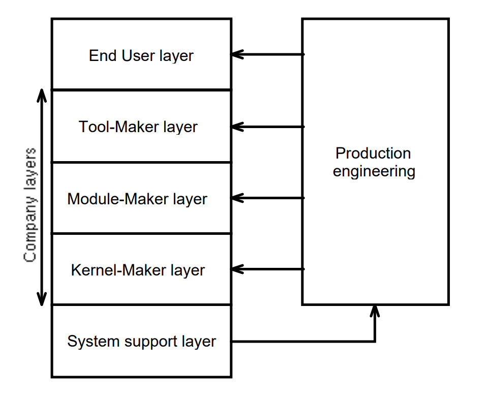

# 问题

如何才能像大师一样，上来就知道抽象的接口应该如何定义? 我为什么总是想不出来该怎么抽象?

# 分析

大师也经常想当然

## 从底往上

大师们鼓吹从底往上构建抽象，把软件工程当数学定理证明一样来搞，这条路是走不通的。业务逻辑和数学不同，业务逻辑就是世界上最没有逻辑可言的东西。

David Parnas 写过一篇文章“[Designing Software for Ease of Extension and Contraction](./designing-software-for-ease-of-extension-and-contraction.pdf)”。里面提到了虚拟机的愿景，一帮程序员写一个虚拟机，给另外一帮程序员来用。那我怎么知道这个虚拟机的指令集应该设计成什么样呢?

Trygve Reenskaug 写过一本书“[Working with objects - The OOram Software Engineering Method](./working-with-objects-the-ooram-software-engineering-method.pdf)”。里面有一张图展示了Trygve， MVC 之父对未来架构的愿景

这种自底而上，逐层构建抽象的做法是看起来很美好的。但是实践中，我们怎么能知道“抽象”是正确的呢?怎么能凭空发明出来呢?

## 高内聚

大师们还曾经鼓吹过高内聚

Glenford J. Myers 写过一本“[Composite/Structured Design](./composite-structured-design.djvu)”。其中提出了一个 Module Strength 的概念。就像我们没有离开地球表面，是受到了地球引力的吸引一样。模块没有散架，是被“高内聚”了。他进而把模块强度分了一个强度等级

* 最强的内聚：Functional strength and informational strength
* Communicational strength
* Procedure strength
* Classical strength
* Logical strength
* 最弱的内聚：Coincidental strength

实践中，这往往会变成给某个模块先取一个名字，然后下一个定义说“xxx类型的业务都往里面放”。从名字开始，望名生义的往里面装东西。
这种以“高内聚”为出发点的思路和自底而上设计是犯了同一个错误，从一个抽象概念开始。无论你定义多么清楚，名字多么具体。
抽象的东西总是可以有无数种解读。没有什么天然的“高内聚”。只是恰好在过去的业务里，这一块没有怎么变化过罢了。

## 不要去发明抽象

这个问题的解决方案就是不要自底而上。而是先使用，再复用。你要先看见了多个变种的具体的业务，实打实地知道在每个业务下所需要的参数是为了什么。然后贯彻本文所述的所有依赖管理原则去构建模块，“抽象”是会自然而然地生长出来的。哪里有什么永恒真理一般的抽象，不过是为了复用一块代码给打出来的“补丁”。在不同的复用目标下，“抽象”也会是不同的。
